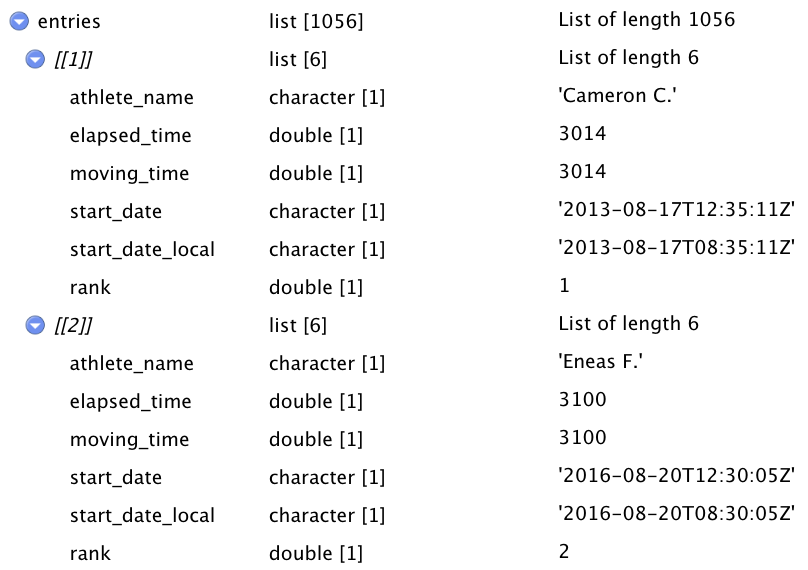
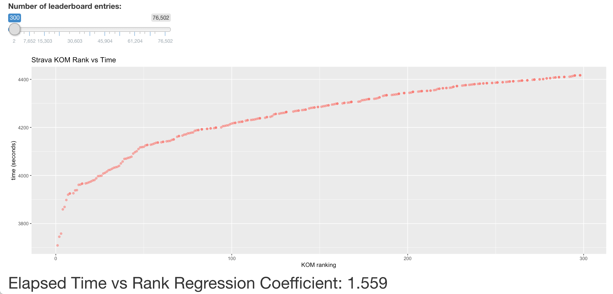
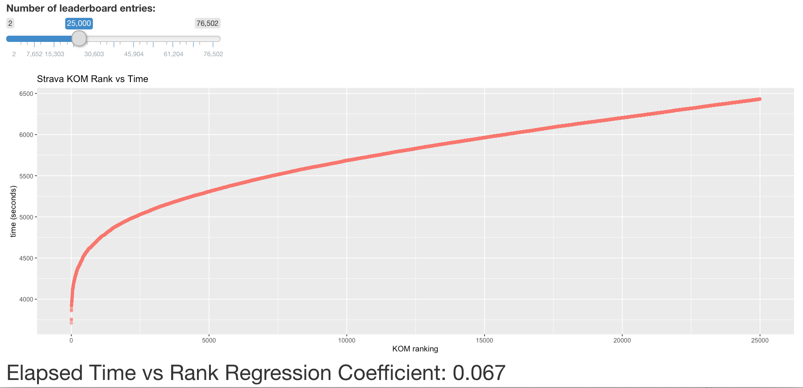
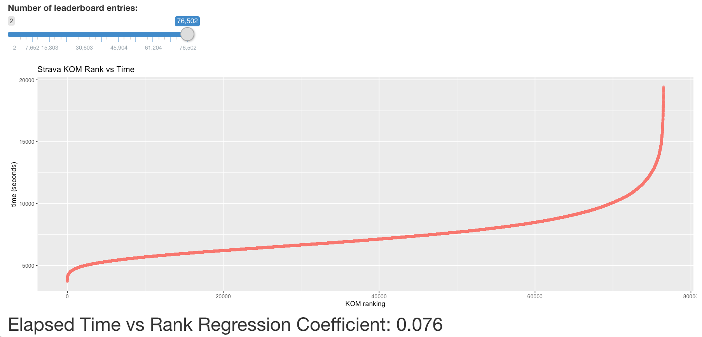
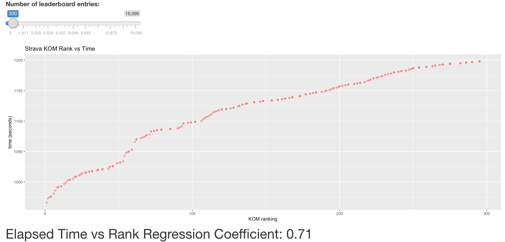
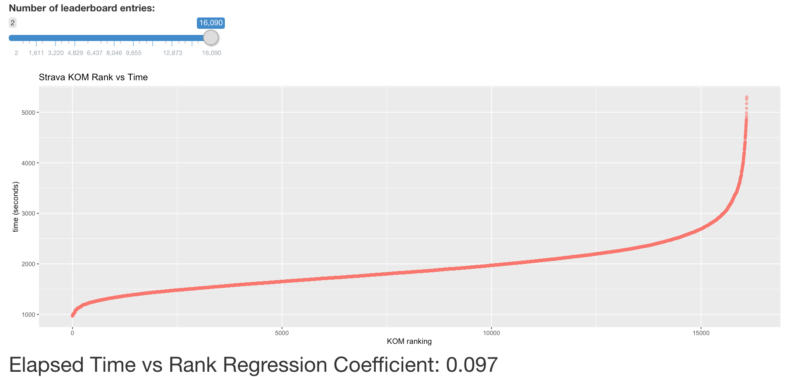

```{r setup, include=FALSE}
knitr::opts_chunk$set(echo = TRUE)
```

# The Data
Strava is a social media platform for uploading and sharing rides, runs, and essentially any workout that you can record with a GPS. This project aims to look at the data available through the Strava third party API and the differing relationship between the King of the Mountain (KOM) ranking and the elapsed time on various climbs. The data sets vary in size, with the smallest being Mount Washington in New Hampshire with 1,056 leaderboard entries, and the largest being Mont Ventoux in France with 76,502 entries.

There is data available for essentially every climb in the world, but I chose to investigate these eight climbs: Col du Galibier, Mont Ventoux, Lookout Mountain, Col de la Madone, Alpe d'Huez, Haleakala Volcano, Mount Washington, Willunga Hill. I chose these climbs in order to have locations from around the world and because some of them have significance to me personally.

# Data Cleaning

The Strava API returns data in a JSON format, and for the collection I used two API calls, for the climb's leaderboard entries, and for the metadata on the climbs themselves. I then cleaned and merged these JSON files together by using regular expression text replacement to merge the two into a single JSON file. I did this for all eight climbs and saved them to eight JSON files. I then used the R library, *rjson*, to convert these into R lists of lists. The structure of the data entry can be seen below:

.{#id .class width=60% height=60%}.

# Analysis

There is a positive correlation between the elapsed time and the KOM ranking which is obvious because the ranking is based on elapsed time with the shortest elapsed time on the climb being ranked number one. What is interesting however is how the coefficient of this relationship varies by climb and by the range of ranks being observed. For example if we observe the first three hundred ranks of of Mont Ventoux data set we see a coefficient of 1.559: 

..

The relation appears exponential, with a steep slope for fastest times but a leveling off for the slower times given less difference in time between each entry. This same relationship appears in most of the climbs. We get a much smaller coefficent of 0.067 if we extend the observed ranks out to 25000:

..

That was only a continuation of the same concave exponential relationship that we saw before, but if we extend all the way out to observe the full data set of 76,502 entries we get a convex exponential relationship for the slowest times:

..

This same pattern is observed for most climbs, but at different degrees. For example the Lookout Mountain climb in Colorado has a much smaller exponential relationship for the very fastest but shows the same relationship with the slowest. One hypothesis for this difference that I have, and for the group of riders who have a much faster time on Mount Ventoux is that this French climb is used frequently in the Tour de France, the world's premier cycling event with the very fastest riders in the world competing. Some of these riders upload their race rides to Strava, and these fastest times may come from those races. Obviously professional atheletes would be a dramatic step above the recreational riders that make up 99% of our seventy-five thousand data points. We may not observe the same dramatic difference in looking at Lookout Mountain, or Mt. Washington for example because there are not professional riders racing at the level of the Tour de France putting their times in the same data set as amateurs. We can observe this difference in looking at the first three hundred entries of Lookout Mountain where we see a coefficient of only 0.71 compared to the 1.559 slope of the first three hundred entries on Ventoux:

..

The lookout data set when looking at the full 16,090 obviously has a different shape to the Ventoux dataset. The difference between each entry, or the slope, is much smaller for the fastest riders than it was on Ventoux, but we still see an exponential drop off in the times for the slowest riders:

..